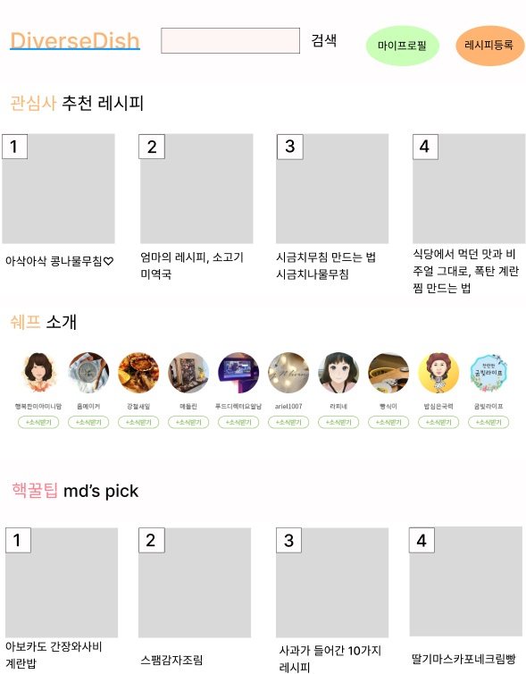
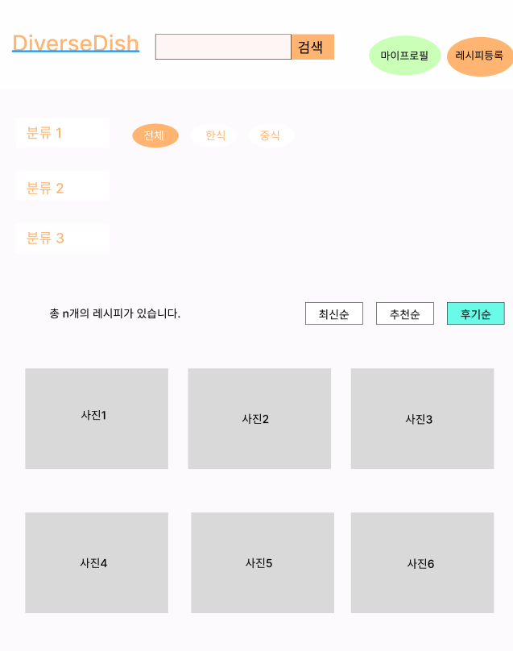
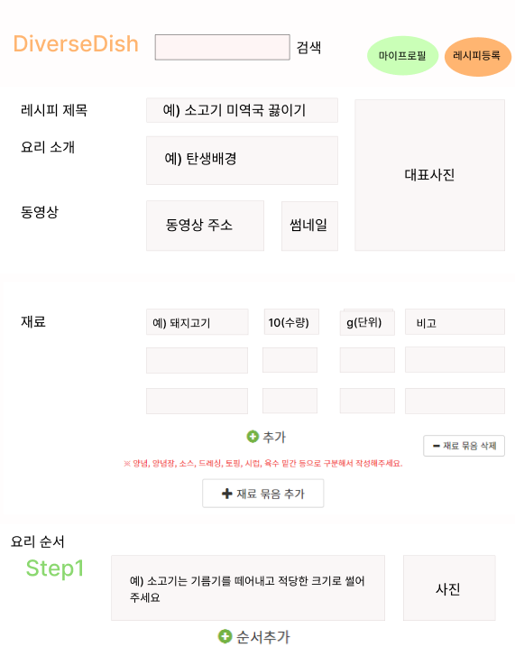
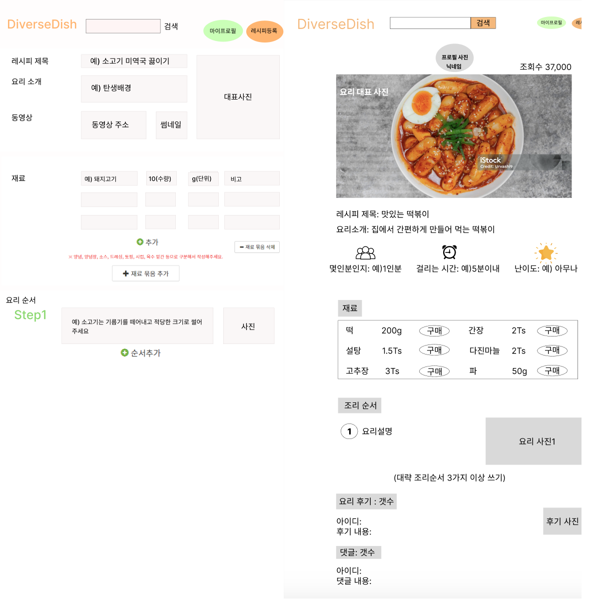
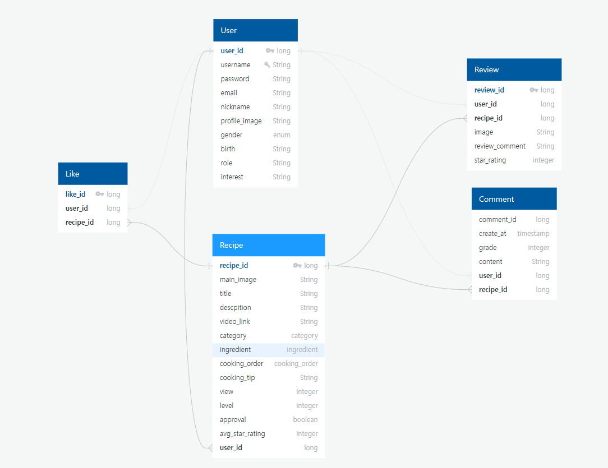
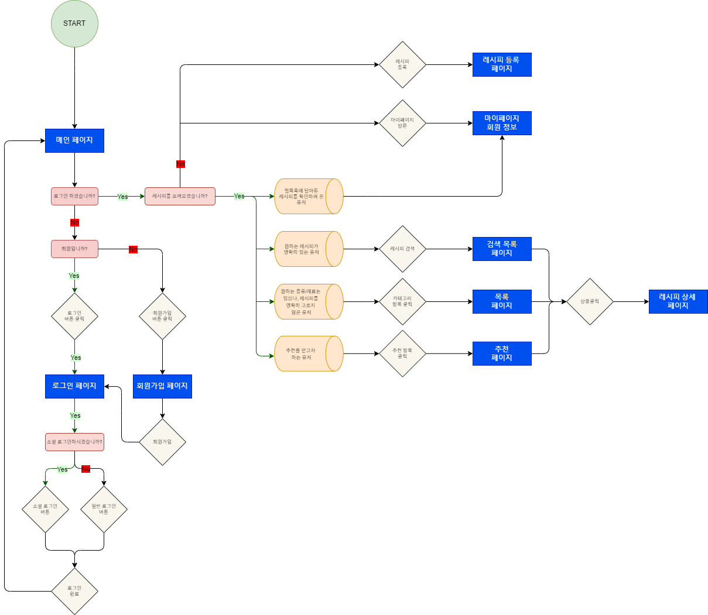
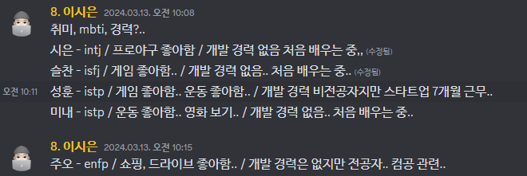
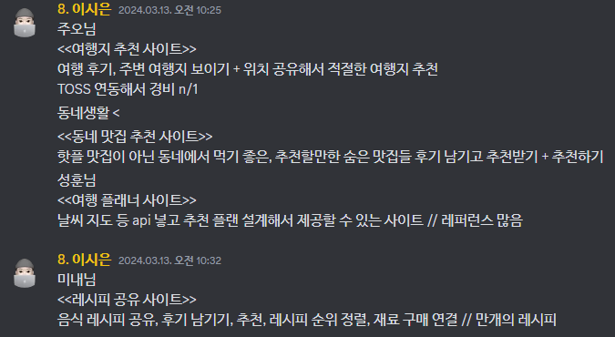

## 팀 구성원, 개인 별 역할

---

### 팀명: 맛둥이들(TasteMates)
 - 팀원 `이시은` | 김슬찬 | 배성훈 | 조미내 | 최주오
 
 #### 1주차 팀 개인별 역할  
 - 이시은: 전체적인 기획 수립 및 팀 구글 시트, 기획서, 발표 대본 작성, 회의 모두 참여  
 - 김슬찬: ERD 작성 및 요구사항 정리서 작성, 회의 모두 참여  
 - 배성훈: main, recipe 등록, category Pigma 작성, 회의 모두 참여  
 - 조미내: my page, recipe 조회 Pigma 작성, 회의 모두 참여  
 - 최주오: 발표 자료 작성, 회의 모두 참여  

## 팀 내부 회의 진행 회차 및 일자
- 1회차(3/13) - 전체 참여
  - 노션 가이드 확인하며 할 일 정리
  - 아이스 브레이킹
  - 아이디어 추출 및 결정
  - 아이디어 확정 후 기획 세분화
  - 구글 시트 작성 및 팀 이름과 프로젝트 이름 정함 `다양다방(DiverseDish)`
 
- 2회차(3/14) - 전체 참여
  - Pigma로 페이지 구체화 및 발표 자료, ERD, 기획서 제작 분담 진행 계획
  - 플로우차트 및 요구사항 정리표 제작 계획

- 3회차(3/15) - 전체 참여
  - 플로우 차트 확인 및 구글 시트 요구사항 정리표 제작
  - 업무 분담 진행, 기획서 완정 

---

## 현재까지 개발 과정 요약 (최소 500자 이상)

---

- 음성 회의를 통해 첫날 아이디어 제시를 진행하여 프로젝트 주제 선정
- 주제 선정 후 웹 사이트의 상세 기능들에 대한 정리 시작

1. 메인 페이지
 - 카테고리 페이지로 이동 가능
 - 다양한 분류와 추천 레시피 정렬 기능 추가 활용

2. 분류 페이지
 - 레시피의 종류별, 재료별, 상황별 분류가능
 - 분류 결과를 최신순, 별점순, 후기순으로 분류 가능

3. 마이 페이지
 - 등록한 레시피와 등록 심사 중인 레시피 목록 확인 가능
 - 내가 찜한 레시피와 작성한 후기, 댓글 목록 확인 가능

4. 레시피 등록 페이지
 - 레시피 제목, 소개, 동영상 주소 첨부(선택), 대표 사진
 - 재료와 수량, 단위, 요리 순서 설명과 사진 첨부 및 등록 가능
 - 요리 순서나 재료의 기본값이 있고 추가하여 작성 가능

 5. 레시피 조회 페이지
  - 상단 레시피 등록 사용자의 프로필 사진과 닉네임 노출
  - 대표 사진과 제목, 설명 노출
  - 요리 순서 노출

- 1차적으로 구현 진행할 수 있는 데드라인을 정해 구체화를 진행함
- 아이디어 회의 중 추후 구현하려는 부분들 정리

- 현재 분업을 나누는 부분과 github 브랜치 사용 방법에 대하여 미숙하여 보완 및 지속적인 회의 중

## 개발 과정에서 나왔던 질문 (최소 200자 이상)

---
- 첫 분담을 어떤 식으로 진행할지
 - 페이지 별 분업, 단 별 분업, 엔티티별 분업 등의 의견 
 > USER / RECIPE / COMENT / REVIEW 단으로 나누어 진행 예정

- 먼저 구현해 볼 기능들과 추후 구현할 기능 정리 필요성 확인

- RECIPE 단 ERD 분리 구성이 필요한 부분을 파악하였으나 현재 회의 및 고민 중

- 팀 내 작업시 규칙 정하자는 의견이 나와 현재 회의 중

- 후기 작성, 댓글 페이지 분리 및 통합 의견 회의 중

## 개발 결과물 공유
---

1. Pigma 작업  

2. ERD 작성

3. 플로우차트 작성

> 첫 아이스 브레이킹, 회의 참여 정리

Github Repository URL: https://github.com/teleport1005/TasteMates_DiverseDish_8team

